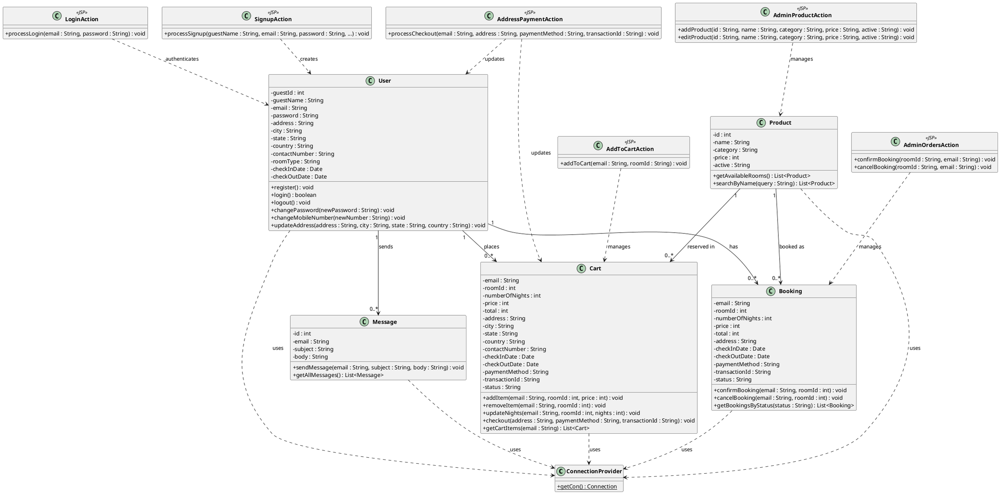
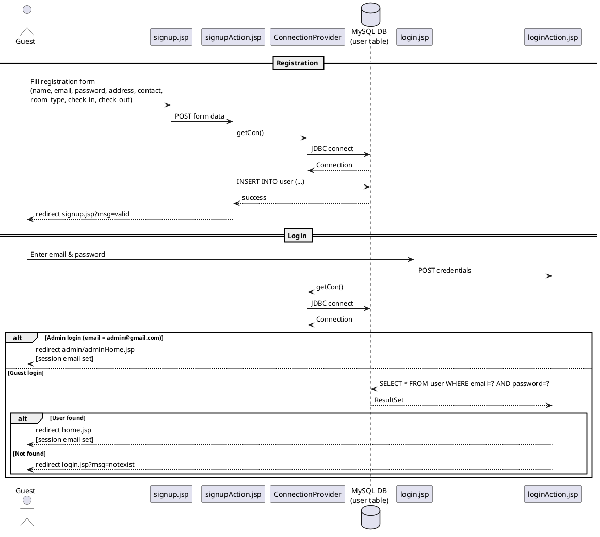
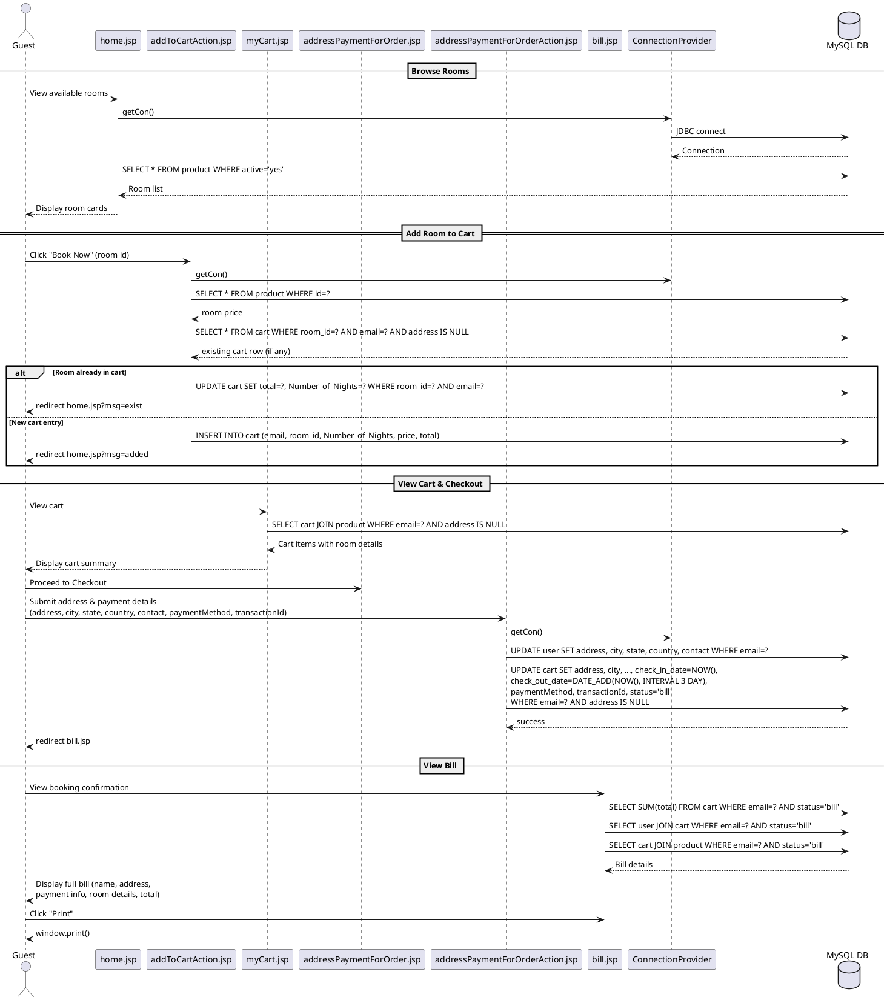
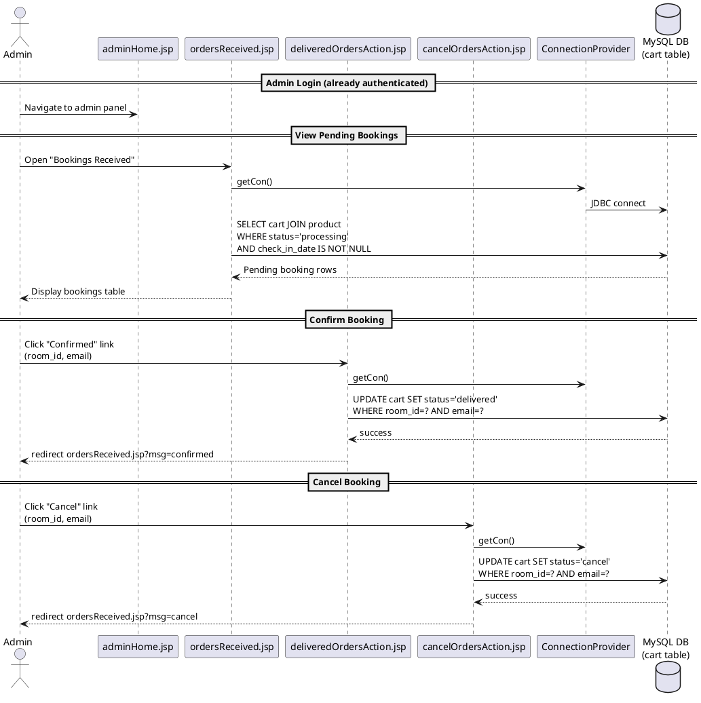

```plantuml
@startuml Use_Case_Diagram
left to right direction
skinparam actorStyle awesome
skinparam packageStyle rectangle

actor "Guest (Customer)" as Guest
actor "Admin" as Admin

rectangle "Online Reservation System" {

  ' ---- Authentication ----
  package "Authentication" {
    usecase "Register / Sign Up" as UC_Register
    usecase "Login" as UC_Login
    usecase "Logout" as UC_Logout
    usecase "Forgot Password" as UC_ForgotPass
    usecase "Change Password" as UC_ChangePass
    usecase "Change Mobile Number" as UC_ChangeMobile
    usecase "Change Security Question" as UC_ChangeSQ
  }

  ' ---- Room Browsing ----
  package "Room Browsing" {
    usecase "Browse Available Rooms" as UC_Browse
    usecase "Search Rooms" as UC_Search
  }

  ' ---- Reservation ----
  package "Reservation Management" {
    usecase "Add Room to Cart" as UC_AddCart
    usecase "View Cart" as UC_ViewCart
    usecase "Remove Room from Cart" as UC_RemoveCart
    usecase "Increase / Decrease Nights" as UC_IncDec
    usecase "Enter Address & Payment" as UC_Payment
    usecase "Place Booking" as UC_PlaceOrder
    usecase "View Bill" as UC_Bill
    usecase "Print Bill" as UC_Print
    usecase "View My Bookings" as UC_MyOrders
  }

  ' ---- Communication ----
  package "Communication" {
    usecase "Contact Us (Message)" as UC_Message
  }

  ' ---- Admin Functions ----
  package "Admin Panel" {
    usecase "Manage Products (Rooms)" as UC_ManageProducts
    usecase "Add New Room" as UC_AddProduct
    usecase "Edit Room Details" as UC_EditProduct
    usecase "View Booking Requests" as UC_ViewOrders
    usecase "Confirm Booking" as UC_Confirm
    usecase "Cancel Booking" as UC_CancelOrder
    usecase "View Delivered/Confirmed Bookings" as UC_ViewDelivered
    usecase "View Messages from Guests" as UC_ViewMessages
  }
}

' Guest associations
Guest --> UC_Register
Guest --> UC_Login
Guest --> UC_Logout
Guest --> UC_ForgotPass
Guest --> UC_ChangePass
Guest --> UC_ChangeMobile
Guest --> UC_ChangeSQ
Guest --> UC_Browse
Guest --> UC_Search
Guest --> UC_AddCart
Guest --> UC_ViewCart
Guest --> UC_RemoveCart
Guest --> UC_IncDec
Guest --> UC_Payment
Guest --> UC_PlaceOrder
Guest --> UC_Bill
Guest --> UC_Print
Guest --> UC_MyOrders
Guest --> UC_Message

' Admin associations
Admin --> UC_Login
Admin --> UC_Logout
Admin --> UC_ManageProducts
Admin --> UC_AddProduct
Admin --> UC_EditProduct
Admin --> UC_ViewOrders
Admin --> UC_Confirm
Admin --> UC_CancelOrder
Admin --> UC_ViewDelivered
Admin --> UC_ViewMessages

' Include relationships
UC_PlaceOrder .> UC_Payment : <<include>>
UC_Bill .> UC_PlaceOrder : <<include>>
UC_Print .> UC_Bill : <<include>>
UC_AddProduct .> UC_ManageProducts : <<include>>
UC_EditProduct .> UC_ManageProducts : <<include>>

' Extend relationships
UC_AddCart .> UC_Login : <<extend>>
UC_PlaceOrder .> UC_Login : <<extend>>

@enduml
```

# UML Diagrams – Online Hotel Reservation System

## System Overview

The **Online Reservation System** is a web-based hotel booking application built with Java/JSP and MySQL. It allows guests to browse available rooms, make reservations, manage their bookings, and receive a bill. An administrator can manage the room inventory and handle booking confirmations or cancellations.

---

## 1. Use Case Diagram

### PlantUML Source

### Design Decisions

| Decision | Rationale |
|---|---|
| Two primary actors (Guest, Admin) | The system has clearly separate roles: a Guest interacts with booking flows, the Admin manages inventory and processes bookings. |
| Authentication package | All identity-related use cases (login, register, change password, etc.) are grouped to highlight the security boundary. |
| `<<include>>` on PlaceBooking → Address & Payment | Providing address and selecting a payment method is a **mandatory** sub-step whenever a booking is placed. |
| `<<extend>>` on Add-to-Cart / Place-Booking → Login | A guest must be authenticated before performing reservation actions; unauthenticated access extends the Login use case. |
| Admin operates independently of Guest flows | The Admin panel is a completely separate UI path (`/admin/*`), ensuring separation of concerns. |

---

## 2. Class Diagram

### PlantUML Source

### Design Decisions

| Decision | Rationale |
|---|---|
| `ConnectionProvider` as a static utility class | Centralises JDBC connection creation (Singleton-like pattern), ensuring consistent driver loading and database URL across all JSP pages. |
| `Cart` and `Booking` modelled separately (conceptually) | Although stored in the same `cart` table, a record transitions through statuses (`NULL address → bill → processing → delivered/cancel`). Separating them conceptually clarifies the lifecycle. |
| `Product` as a first-class entity | Rooms/products are independently managed by the admin (add, edit, deactivate) and referenced by Cart/Booking, so a standalone class avoids duplication. |
| `Message` as a standalone class | Guest feedback/queries are unrelated to booking flows and stored independently, making them easy to extend (e.g., reply functionality) without affecting core booking logic. |
| JSP pages modelled as `<<JSP>>` controller classes | JSP action pages act as thin controllers (like Servlets), bridging UI input to domain-model operations. This mirrors an MVC pattern without a formal framework. |

---

## 3. Sequence Diagram

Three key scenarios are illustrated below.

---

### 3a. Guest Registration and Login

---

### 3b. Room Browsing, Add to Cart, and Place Booking

---

### 3c. Admin – Confirm or Cancel a Booking

### Design Decisions

| Decision | Rationale |
|---|---|
| Three separate sequence diagrams | Each diagram focuses on a distinct system flow (authentication, booking lifecycle, admin operations) to keep them readable and targeted. |
| `ConnectionProvider` shown as an explicit lifeline | Since every database operation goes through this utility, surfacing it in the sequence diagram makes the data-access pattern explicit. |
| `alt/else` fragments for conditional paths | Login and add-to-cart both have branching behaviour that must be captured to show the complete flow (not just the happy path). |
| `status` field progression (`NULL → bill → processing → delivered/cancel`) | Using a single field to track the cart/booking lifecycle avoids multiple tables, but the sequence diagrams make the state transitions visible. |
| Booking confirmation/cancellation done by Admin only | Business rule: guests cannot directly confirm their own bookings; the Admin acts as the hotel front-desk approving or rejecting reservations. |

---

## 4. Entity-Relationship Summary

The following table summarises the four database tables and their relationships, complementing the class diagram above.

| Table | Primary Key | Foreign Keys / Relations |
|---|---|---|
| `user` | `guest_id` (AUTO_INCREMENT) | Referenced by `cart.email` (via `email`) |
| `product` | `id` | Referenced by `cart.room_id` |
| `cart` | *(composite: email + room_id)* | `email → user.email`, `room_id → product.id` |
| `message` | `id` (AUTO_INCREMENT) | `email → user.email` (logical) |

> **⚠️ Known Design Issues in the Current Implementation**
>
> The following limitations exist in the codebase and should be addressed in a production-grade redesign:
>
> 1. **Hardcoded admin credentials** – The admin account is checked with a hardcoded email (`admin@gmail.com`) and password in `loginAction.jsp`. A proper implementation should store admin accounts in the database with hashed passwords and role-based access control (RBAC).
>
> 2. **Auto-assigned check-in/check-out dates** – The checkout action (`addressPaymentForOrderAction.jsp`) sets `check_in_date = NOW()` and `check_out_date = DATE_ADD(NOW(), INTERVAL 3 DAY)`, overriding any dates the guest provided during registration. A production system should respect the guest's chosen dates end-to-end.
>
> 3. **Mutable `status` in composite key** – The `cart` table lacks a dedicated surrogate primary key (`AUTO_INCREMENT id`). Using `(email, room_id)` as a logical key alongside a mutable `status` column makes updates fragile and complicates foreign-key constraints. Adding an `id INT AUTO_INCREMENT PRIMARY KEY` column is recommended.
>
> 4. **Inconsistent column naming** – The `cart` schema mixes naming conventions (`Number_of_Nights` in PascalCase vs. `room_id`, `check_in_date` in snake_case). All column names should follow snake_case for consistency.

---

## How to Render the Diagrams

The PlantUML code blocks above can be rendered using any of the following tools:

1. **[PlantUML Online Server](https://www.plantuml.com/plantuml/uml/)** – paste the code between `@startuml` and `@enduml`.
2. **VS Code** – install the *PlantUML* extension and press `Alt+D` to preview.
3. **IntelliJ IDEA** – install the *PlantUML Integration* plugin.
4. **GitHub** – use a Markdown renderer that supports PlantUML (e.g., `mermaid` fenced code blocks, or a GitHub Action that generates SVG/PNG images from `.puml` files).
